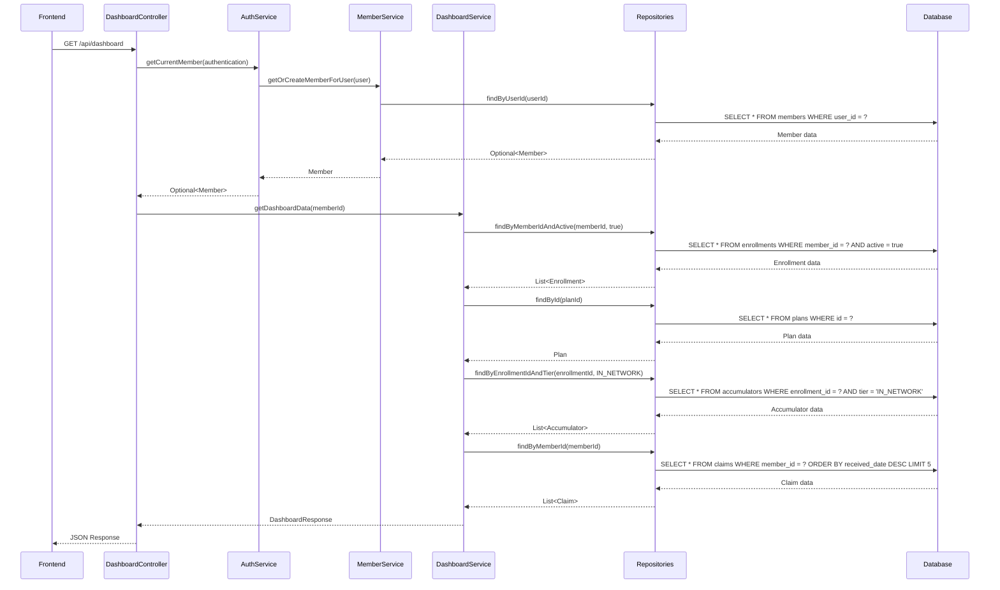
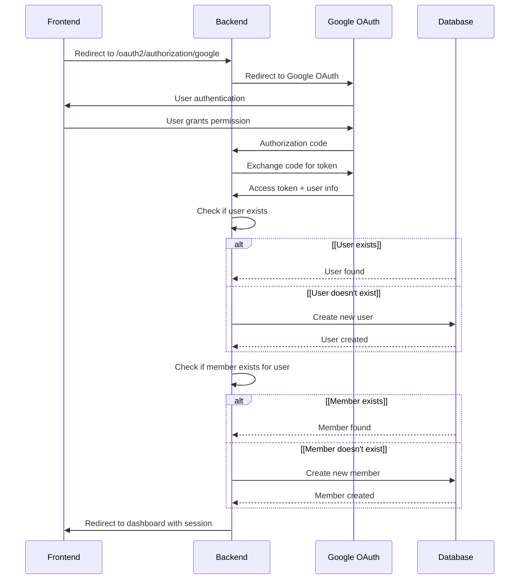

# Member Benefits Dashboard - Backend Architecture Documentation

## Table of Contents
1. [Project Overview](#project-overview)
2. [Spring Boot Application Structure](#spring-boot-application-structure)
3. [Component Architecture](#component-architecture)
4. [Data Flow](#data-flow)
5. [Key Components Breakdown](#key-components-breakdown)
6. [Database Integration](#database-integration)
7. [Security Implementation](#security-implementation)
8. [API Endpoints](#api-endpoints)


## Project Overview 

**Key Technologies:**
- Spring Boot 3.5.6
- Spring Security with OAuth2
- Spring Data JPA
- PostgreSQL Database
- Flyway Database Migration
- OpenAPI/Swagger Documentation

**Directory Structure**
```bash
backend/src/main/java/com/memberbenefits/
├── config/           # Configuration classes
├── controller/       # REST API endpoints
├── domain/           # Entity models and DTOs
│   ├── entity/       # JPA entities
│   ├── embeddable/   # Embedded objects
│   └── enums/        # Enumeration types
├── dto/              # Data Transfer Objects
├── repository/       # Data access layer
└── service/          # Business logic layer
```

## Spring Boot Application Structure
**Architecture Pattern**
A Spring Boot project follows a 3-tier architecture:

1. Presentation Layer (**Controllers**)
```bash
The entry point for all HTTP requests, handling
- Request Mapping
- Input Validation
- Auth/Authorization
- Response Formatting
- Error Handling  

Controller Responsibilities
- Request handling maps HTTP GET requests
- Logic is delegated to serice layer
- Manages response management for control over HTTP response
```

2. Business Logic (**Services**)
```bash
Contains core logic and sends to different components
- Business Rules/Logic
- Transaction Management (Consistent Data)
- Sends to repositories as needed
- Data Transformation (Entity to DTO)
```

3. Data Access Layer (**Repositories**)
```bash
Abstract database access and data operations
- CRUD Operations
- Query Abstraction (Hides complex SQL)
- Database
```
```
// Spring Data JPA automatically generates queries based on method names
Optional<Member> findByUserId(UUID userId);
// Generated SQL: SELECT * FROM members WHERE user_id = ? 
```

**Data Flow**

## Authentication Flow



## Component Architecture
**1. Controllers (Presentation Layer)**
Handles HTTP requests and responses and delegates business logic to services
**Key Annotations** 
- `@RestController`: Combines `@Controller` + `@ResponseBody`
- `@RequestMapping`: Base URL mapping
- `@GetMapping`, `@PostMapping`: HTTP method mapping
- `@Operation`: OpenAPI documentation

**2. Services (Business Logic Layer)**
Implements business logic, coordinates between repositories, and handles transactions
**Key Annotations** 
- `@Service`: A spring service component
- `@Transactional`: Handles database transactions
- `@RequiredArgsConstructor`

**3. Repositories (Data Access Layer)**
Provides abstract database access and CRUD operations for custom queries
**Key Annotations** 
- Extends `JpaRepository<Entity, ID>` for CRUD 
- Custom query methos using method naming conventions
- `@Query` annotions for complex queries

**4. Domain Entities (Data Model)**
Represents database tables as Java Objects using JPA annotions
**Key Annotations** 
- `@Entity`: Marks a JPA Entity
- `@Table`: Specifies a table name and indexes
- `@Id`: Primary key field
- `@GeneratedValue`: Auto generation strategy
- `@Column`: Column Mapping
- `@OneToMany`, `@ManyToOne`: Relationship mappings
- `@Embedded`: Embedded objects
****5. DTOs (Data Transfer Objects)**
Transfers data between objects and layers without exposing internal entity structure

## Database Integration

**1. Configuration (`appliction.yml`)**
- Prevents hibernate from modifying schema
- Flyway handles database migration
- PostrgeSQL dialect config

**2. Database Schema (Flyway Migration)**
Defined a universal database schema for migrations
**Key Tables:**
- `users`
- `members`
- `plans`
- `enrollments`
- `claims`
- `claim_lines`
- `accumulators`
- `providers`

## Security Implementation

## API Endpoints
| Method | Endpoint | Description | Auth |
|--------|----------|-------------|------|
| GET | `/api/auth/me` | Get current user info | Required |
| GET | `/api/auth/member` | Get current member info | Required |
| GET | `/api/dashboard` | Get dashboard data | Required |
| GET | `/api/claims` | Get claims list with filters | Required |
| GET | `/api/claims/{claimId}` | Get claim details | Required |
| GET | `/api/claims/{claimId}/eob` | Download EOB PDF | Required |
| GET | `/swagger-ui/**` | API documentation | None |
| GET | `/actuator/health` | Health check | None |
| GET | `/oauth2/**` | OAuth2 endpoints | None |